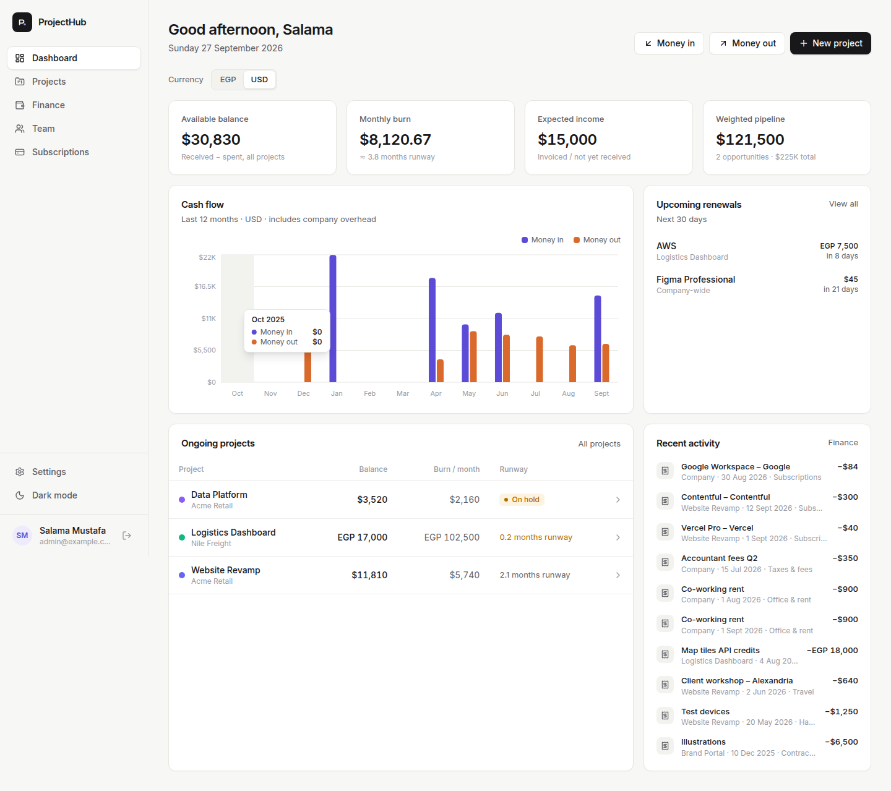

# ProjectHub

A small, self-hosted web app to keep control of your projects and their money:
descriptions, documents, team allocations, salaries, subscriptions, incoming payments —
and the **available balance** each project has left to pay from.

Built for a small team (2–5 people). Tickets and tasks stay in Jira; each project can link to its Jira board.



## What it does

| Area | What you get |
|---|---|
| **Projects** | Ongoing (active / on hold), **Opportunities** (estimated value + win chance), and **Past** (completed / lost / cancelled). Description, client, dates, owner, contract value, Jira link, notes log. |
| **Balance per project** | `Available balance = money received − money spent`. Also shows expected (invoiced) income, monthly burn (payroll + subscriptions) and **runway** in months. |
| **Money in** | Client payments per project, marked *Received* or *Expected / invoiced*. |
| **Money out** | Expenses per project by category (salaries, subscriptions, contractors, software, hardware, travel…) **or company overhead** not tied to a project (rent, accountant…). |
| **Team** | People with monthly salary/cost. Assign them to projects with an allocation % and a monthly cost to that project. See who is over- or under-allocated. |
| **Payroll** | One click per project per month: *Record payroll* creates a salary expense for every assigned person. Safe to run twice — duplicates are skipped. |
| **Subscriptions** | Company-wide or per project, monthly / quarterly / yearly. *Pay* records the expense and moves the renewal date forward. Renewals due in the next 30 days show on the dashboard. |
| **Documents** | Upload files (contracts, proposals, invoices…) or add links (Drive, Confluence, Notion). |
| **Finance** | All transactions across projects with filters and **CSV export**. |
| **Currencies** | Each project has its own currency (USD, EUR, EGP, SAR, AED…). Totals are grouped per currency — nothing is converted. |
| **Users** | Email + password sign-in. Admins add users and reset passwords. Light and dark mode. |

## Quick start on a Mac without Docker

Double-click **`Start ProjectHub (no Docker).command`**. It uses the bundled Node.js (`run-local/runtime`)
and a built-in PostgreSQL engine ([PGlite](https://pglite.dev)), so nothing needs installing.
Your browser opens at http://localhost:8080. Keep the Terminal window open while you use the app;
close it to stop. Data is kept in `run-local/data/` (back up that folder to keep it safe).

This mode is for one computer. For the shared server your team uses, run the Docker setup below.
Data does not move between the two automatically.

## Run it (any OS with Docker)

Requirements: **Docker** with **Docker Compose** (Docker Desktop on macOS/Windows, or Docker Engine on Linux).

```bash
cd ProjectHub
cp .env.example .env          # Windows PowerShell:  copy .env.example .env
# edit .env: set POSTGRES_PASSWORD, ADMIN_EMAIL, ADMIN_PASSWORD
docker compose up -d --build
```

Open **http://localhost:8080** (or `http://<server-ip>:8080` from other machines) and sign in with the
`ADMIN_EMAIL` / `ADMIN_PASSWORD` from `.env`. Then go to **Settings → Users** to add your 2–3 teammates,
and change your own password.

> The admin account is only created on the very first start. Changing `ADMIN_PASSWORD` later has no effect —
> use Settings instead.

The image builds for both `amd64` (normal Intel/AMD servers) and `arm64` (Apple Silicon, ARM servers).

### Everyday commands

```bash
docker compose ps                 # status
docker compose logs -f app        # app logs
docker compose down               # stop (data is kept)
docker compose up -d --build      # update after changing code / pulling a new version
```

### Where data lives

Two Docker volumes, kept across restarts and rebuilds:

- `db_data` — the PostgreSQL database
- `app_data` — uploaded documents and the session secret

`docker compose down -v` **deletes** both. Don't use `-v` unless you want to wipe everything.

## Backups

```bash
./scripts/backup.sh                                   # Linux / macOS
powershell -ExecutionPolicy Bypass -File scripts\backup.ps1   # Windows
```

This writes `backups/db-<date>.dump` and the uploaded files into `backups/`. The Linux script keeps the
newest 30. To back up nightly on a Linux server, add a cron entry (`crontab -e`):

```
0 2 * * * cd /opt/ProjectHub && ./scripts/backup.sh >> backups/backup.log 2>&1
```

Restore (replaces current data):

```bash
./scripts/restore.sh backups/db-20261001-020000.dump backups/uploads-20261001-020000.tar.gz
```

Copy the `backups/` folder somewhere off the server from time to time.

## Deploying on a Linux server

**One click from your Mac:** double-click `Deploy to server.command` (or run
`./scripts/deploy.sh root@your-server-ip`). It uploads the project to `/opt/ProjectHub`, installs Docker if
needed, creates a secure `.env`, builds and starts the app, schedules a nightly backup, and prints the URL and
first admin password (also saved to `server-login.txt`). Run it again any time to deploy updates — settings,
database and uploads are kept.

Manual steps, if you prefer:

1. Install Docker Engine + Compose plugin (<https://docs.docker.com/engine/install/>).
2. Copy this folder to the server, e.g. `/opt/ProjectHub` (`scp -r ProjectHub user@server:/opt/`).
3. `cd /opt/ProjectHub && cp .env.example .env && nano .env`
4. `docker compose up -d --build`
5. Open port 8080 on the firewall if needed (`sudo ufw allow 8080/tcp`).

**HTTPS (recommended if reachable from outside your office network):** put it behind a reverse proxy such as
Caddy or Nginx with a certificate, then set `COOKIE_SECURE=true` in `.env`. A minimal Caddyfile:

```
projects.yourcompany.com {
    reverse_proxy localhost:8080
}
```

## How the numbers are calculated

- **Available balance** (per project) = sum of *received* payments − sum of all expenses charged to the project.
- **Expected income** = payments marked *Expected* (invoiced but not received). Not counted in the balance.
- **Monthly burn** = monthly cost of people currently assigned + active project subscriptions
  (quarterly ÷ 3, yearly ÷ 12).
- **Runway** = available balance ÷ monthly burn.
- **Weighted pipeline** = Σ opportunity value × win chance.
- **Company overhead** = expenses and subscriptions not linked to a project. They appear in the dashboard cash-flow
  chart and the Finance page, but are not subtracted from any project's balance.

All amounts linked to a project use that project's currency.

## Development (optional)

Needs Node.js 22+ and a local PostgreSQL.

```bash
# API  (http://localhost:8080)
cd server && npm install
POSTGRES_PASSWORD=... npm run dev

# Web UI with hot reload (http://localhost:5173, proxies /api to :8080)
cd web && npm install && npm run dev
```

Stack: React + TypeScript + Tailwind CSS (Vite) · Node.js + Express + TypeScript · PostgreSQL 16.
Database migrations live in `server/migrations/` and run automatically on start — to change the schema,
add a new numbered `.sql` file (e.g. `002_add_field.sql`).

```
ProjectHub/
├── docker-compose.yml     # app + postgres
├── Dockerfile             # builds UI + API into one image
├── .env.example           # settings template
├── scripts/               # backup / restore
├── server/                # API (Express) + SQL migrations
└── web/                   # UI (React)
```
